 `avg_pool = x.mean(dim=(2, 3))`
 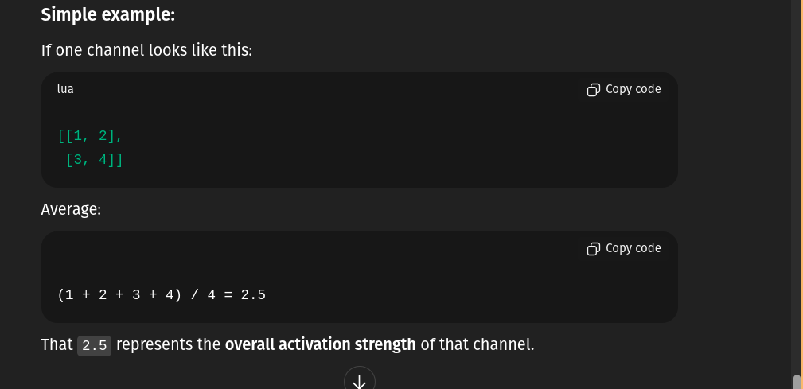

 ` weights = self.sigmoid(self.relu(self.conv(pooled.unsqueeze(1))))`

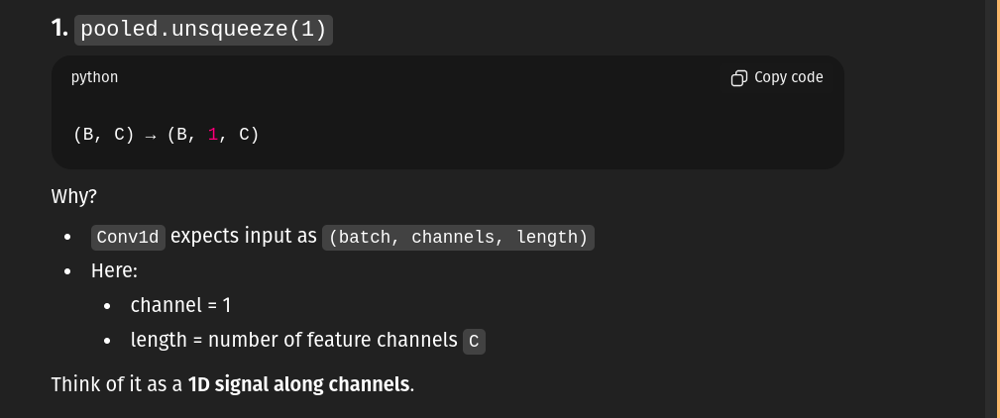
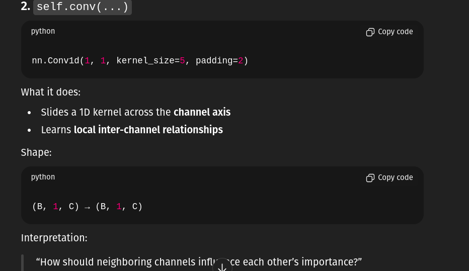
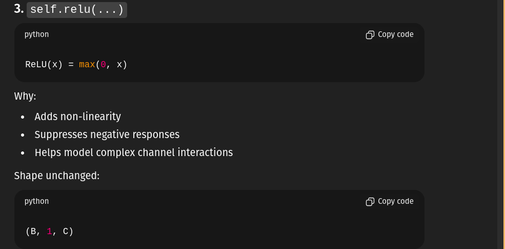
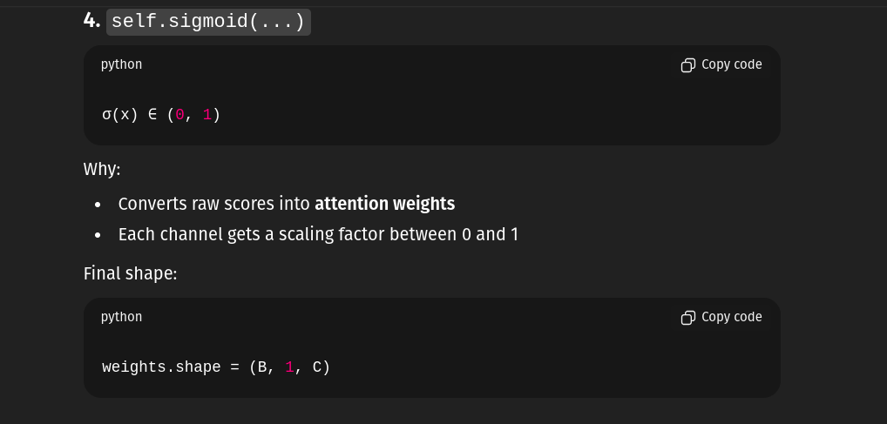

`return x * weights.view(B, C, 1, 1)`
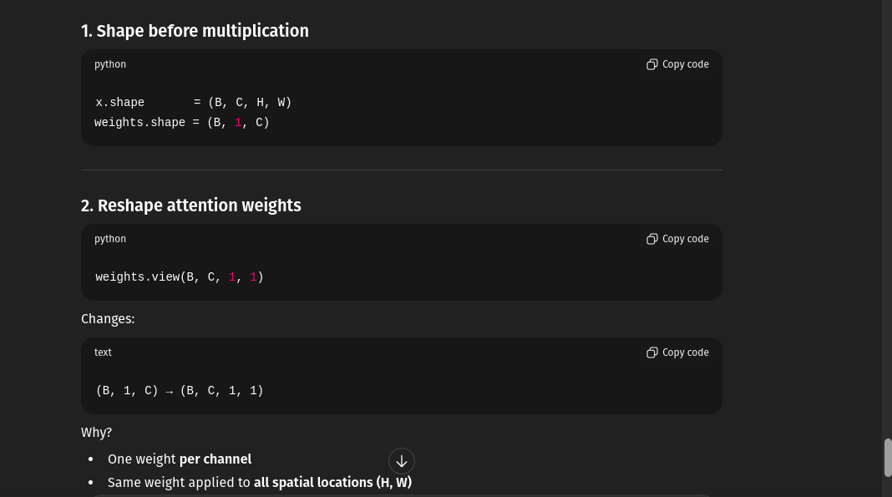
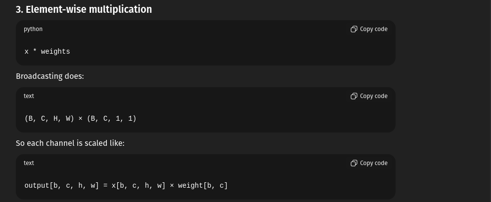
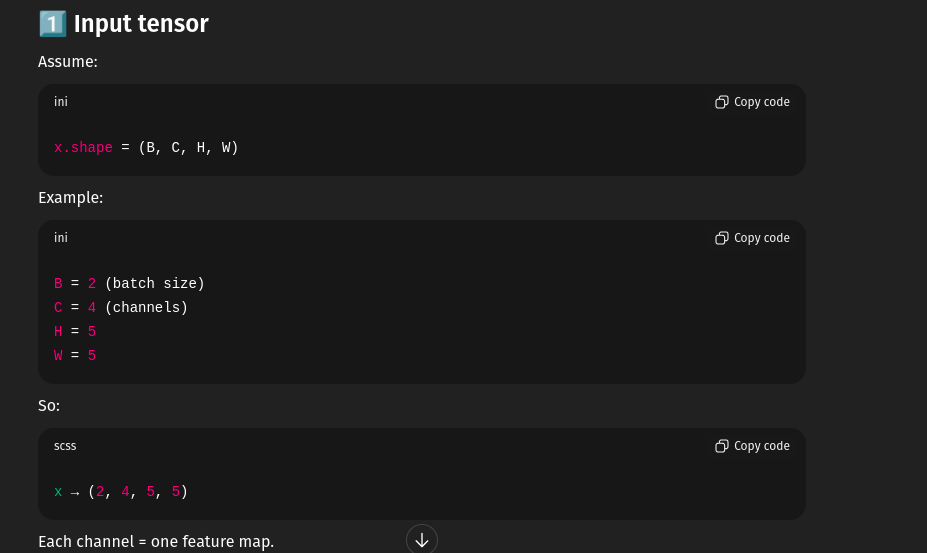
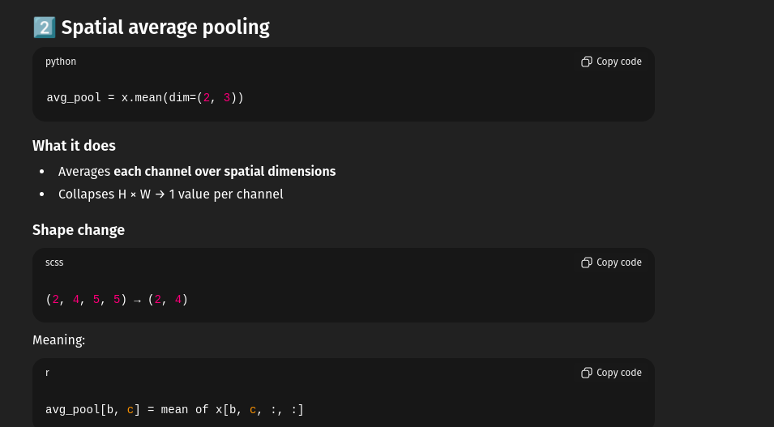
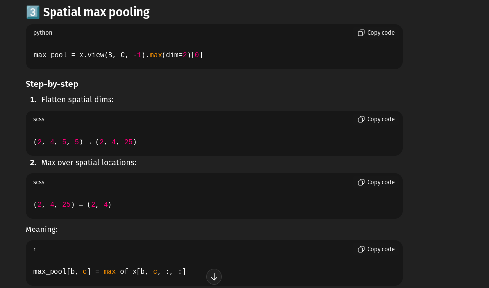
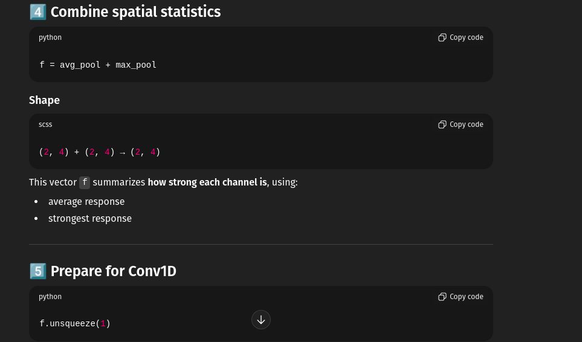
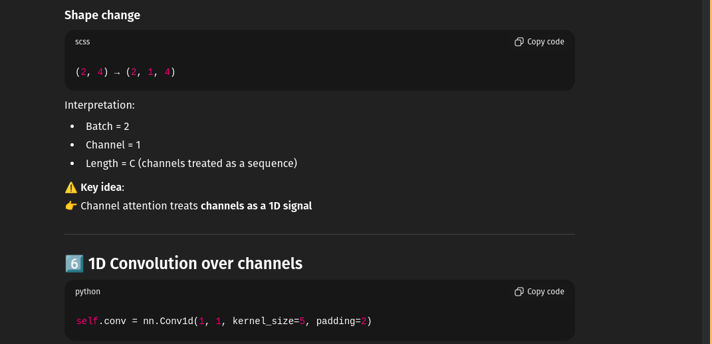

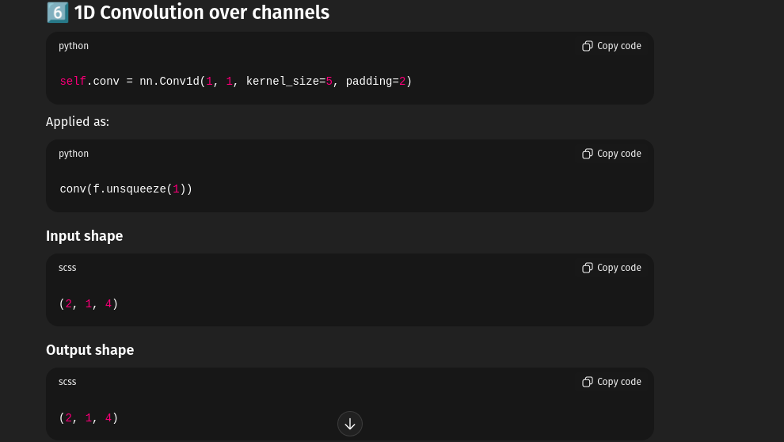

`nn.Conv2d(
    in_channels,
    out_channels,
    kernel_size,
    padding=padding,
    dilation=dilation
)
`
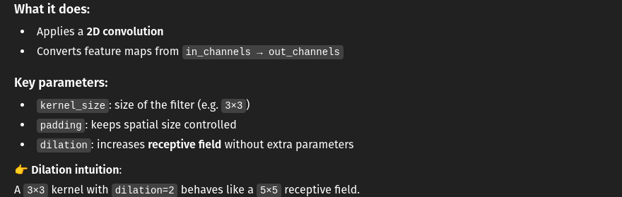
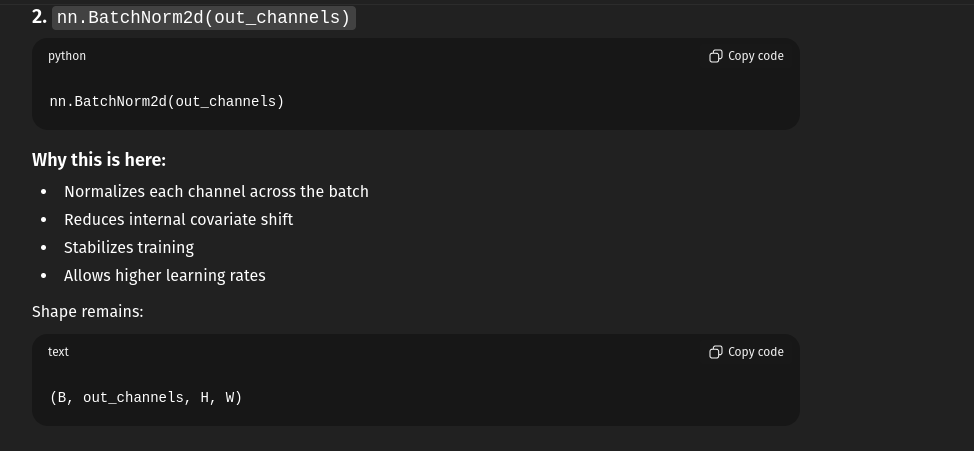